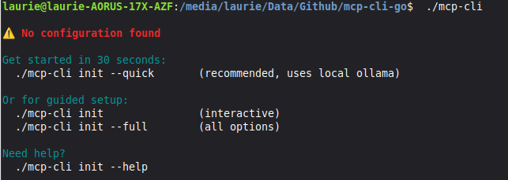
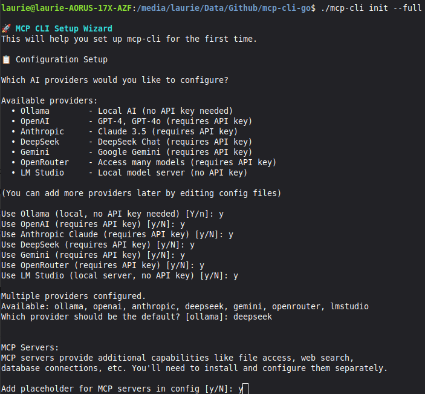

# Quick Start Guide

This guide will get you up and running with MCP-CLI-Go in under 10 minutes.

## Prerequisites

- Downloaded binary from [releases page](https://github.com/LaurieRhodes/mcp-cli-go/releases)
- (Optional) API keys for cloud AI providers (OpenAI, Anthropic, etc.)
- (Optional) Ollama installed for local models

## First Run

The first time you run mcp-cli, you'll see an error that no configuration file is found:



This is expected! Let's create the configuration.

---

## Initialize Configuration

MCP-CLI provides an interactive setup wizard to create your configuration.

### Option 1: Quick Setup (Recommended for First-Time Users)

For a minimal setup using Ollama (no API keys needed):

```bash
mcp-cli init --quick
```

**What this creates:**

- Ollama provider configuration (local AI, no API key required)
- Basic directory structure
- Example templates

**Best for:** Testing the tool, local-only usage, or when you don't have API keys yet.

### Option 2: Full Setup (Recommended for Production Use)

For a complete setup with multiple AI providers:

```bash
mcp-cli init
```

The wizard will ask about each provider:



**What this creates:**

- Configuration for selected AI providers
- Embedding service configurations
- Directory structure for MCP servers
- Template library foundation

**Best for:** Production use, multi-provider workflows, or when you have API keys.

---

## Directory Structure

After initialisation, you'll have a modular configuration structure:

```
your-executable-location/
├── mcp-cli                  # The executable
├── .env                     # API keys (if using cloud providers)
├── config.yaml              # Main configuration file
└── config/
    ├── README.md            # Configuration guide
    ├── embeddings/          # Embedding service configs
    │   ├── openai.yaml
    │   └── ollama.yaml
    ├── providers/           # AI provider configs
    │   ├── ollama.yaml
    │   ├── openai.yaml
    │   ├── anthropic.yaml
    │   └── ...
    ├── runas/               # MCP definitions for workflows
    ├── servers/             # MCP server configs
    │   └── README.md
    └── templates/           # Workflow templates
        └── README.md
```

### Understanding Each Directory

#### `providers/` - AI Provider Configurations

This directory contains configuration files for each AI provider. Each file defines:

- API endpoints
- Available models
- Default parameters
- Token limits

**Example:** `config/providers/openai.yaml`

```yaml
provider_name: openai
models:
  - name: gpt-4o
    max_tokens: 4096
    supports_tools: true
  - name: gpt-4o-mini
    max_tokens: 16384
    supports_tools: true
api_key: ${OPENAI_API_KEY}
api_endpoint: https://api.openai.com/v1
```

**Key Points:**

- Use `${VARIABLE_NAME}` syntax to reference environment variables
- Add new models by editing these files
- Each provider can have multiple models configured

#### `embeddings/` - Embedding Service Configurations

Embedding services convert text into vector representations for similarity search and RAG applications.

**Example:** `config/embeddings/openai.yaml`

```yaml
provider_name: openai
model: text-embedding-3-small
dimensions: 1536
api_key: ${OPENAI_API_KEY}
api_endpoint: https://api.openai.com/v1
```

**Key Points:**

- Embeddings are separate from chat/completion providers
- Used for vector search, similarity matching, and RAG workflows
- Not all providers support embeddings

#### `servers/` - MCP Server Configurations

MCP servers provide additional capabilities like file access, web search, and database connections.

**Example:** `config/servers/brave-search.yaml`

```yaml
server_name: brave-search
description: Web search powered by Brave
config:
  command: /usr/local/bin/brave-search-server
  args: []
  env:
    BRAVE_API_KEY: ${BRAVE_API_KEY}
```

**Key Points:**

- MCP servers extend AI capabilities with tools
- Each server must be installed separately
- Servers run as separate processes that mcp-cli communicates with
- See [MCP documentation](https://modelcontextprotocol.io) for available servers

**To add a server:**

1. Install the MCP server binary
2. Create a YAML file in `config/servers/`
3. Configure the command, args, and environment variables
4. Reference the server by name in queries

#### `templates/` - Workflow Templates

Templates define reusable AI workflows. They're the most powerful feature of MCP-CLI.

**Example:** `config/templates/analyze.yaml`

```yaml
name: analyze
description: Analyze and summarize data
version: 1.0.0

steps:
  - name: analyze
    prompt: "Analyze this data: {{stdin}}"
    output: analysis

  - name: summarize
    prompt: "Create 3-bullet summary: {{analysis}}"
```

**Key Points:**

- Templates can call other templates (composition)
- Use `{{variable}}` syntax for data flow between steps
- Can specify different providers for different steps
- Supports conditional logic, loops, and parallel execution

---

## Adding API Keys

If you selected cloud providers during initialization, you need to add API keys.

### Method 1: Environment File (Recommended)

Edit the `.env` file created next to your executable:

```bash
# .env file
OPENAI_API_KEY=sk-...
ANTHROPIC_API_KEY=sk-ant-...
DEEPSEEK_API_KEY=sk-...
GEMINI_API_KEY=...
OPENROUTER_API_KEY=sk-or-...
```

**Security Note:** The `.env` file is in `.gitignore` and won't be committed to version control.

### Method 2: Environment Variables

Set environment variables in your shell:

```bash
export OPENAI_API_KEY=sk-...
export ANTHROPIC_API_KEY=sk-ant-...
```

Add these to your `~/.bashrc` or `~/.zshrc` to make them permanent.

### Method 3: Config Files

You can also put API keys directly in provider config files, though this is less secure:

```yaml
# config/providers/openai.yaml
api_key: sk-your-actual-key-here  # Not recommended for production
```

---

## Your First Query

Now that configuration is complete, let's run your first query:

```bash
# Basic query
mcp-cli query "What is the Model Context Protocol?"

# With specific provider
mcp-cli query --provider anthropic "Explain MCP in detail"

# With specific model
mcp-cli query --provider openai --model gpt-4o "What is MCP?"

# JSON output (for scripting)
mcp-cli query --json "List top 5 programming languages" > output.json
```

### Using Local Models (Ollama)

If you installed Ollama:

```bash
# Make sure Ollama is running
ollama serve

# Query with local model
mcp-cli query --provider ollama --model llama3.2 "Hello, world!"
```

---

## Your First Template

Templates are where MCP-CLI really shines. Let's create a simple analysis workflow.

### 1. Create the Template

Create `config/templates/simple_analysis.yaml`:

```yaml
name: simple_analysis
description: Analyze text and provide insights
version: 1.0.0

steps:
  - name: analyze
    prompt: |
      Analyze the following text:
      {{stdin}}

      Provide:
      1. Main themes
      2. Key insights
      3. Action items
    output: analysis

  - name: summarize
    prompt: |
      Based on this analysis:
      {{analysis}}

      Create a 3-sentence executive summary.
```

### 2. Run the Template

```bash
# From stdin
echo "Our Q4 sales exceeded targets..." | mcp-cli --template simple_analysis

# From file
cat report.txt | mcp-cli --template simple_analysis

# With input flag
mcp-cli --template simple_analysis --input-data "$(cat report.txt)"
```

### 3. List Available Templates

```bash
mcp-cli --list-templates
```

---

## Multi-Provider Workflow Example

Here's where it gets powerful - using different AI providers for different tasks:

Create `config/templates/research_workflow.yaml`:

```yaml
name: research_workflow
description: Multi-provider research pipeline
version: 1.0.0

steps:
  # Step 1: Claude researches (best for comprehensive analysis)
  - name: research
    provider: anthropic
    model: claude-sonnet-4
    prompt: "Research this topic in detail: {{stdin}}"
    output: findings

  # Step 2: GPT-4 fact-checks (different perspective)
  - name: verify
    provider: openai
    model: gpt-4o
    prompt: "Fact-check this research: {{findings}}"
    output: verified

  # Step 3: Local model summarizes (free!)
  - name: summarize
    provider: ollama
    model: qwen2.5:32b
    prompt: "Create executive summary: {{verified}}"
```

Usage:

```bash
echo "Impact of AI on healthcare" | mcp-cli --template research_workflow
```

**Why this is powerful:**

- Uses Claude's research capabilities
- Validates with GPT-4's different training
- Summarizes locally for free
- Each step is optimized for what that model does best

---

## Using MCP Servers

If you've configured MCP servers, you can use them in queries:

```bash
# Query with specific server
mcp-cli query --server brave-search "What's happening in AI today?"

# Multiple servers
mcp-cli query --server filesystem,brave-search "Find files and search web"

# In templates
```

Create `config/templates/web_research.yaml`:

```yaml
name: web_research
description: Research using web search
version: 1.0.0

steps:
  - name: search
    prompt: "Search for: {{stdin}}"
    servers: [brave-search]
    output: search_results

  - name: analyze
    prompt: "Analyze these results: {{search_results}}"
```

---

## Chat Mode

For interactive conversations:

```bash
# Start chat
mcp-cli chat

# With specific provider
mcp-cli chat --provider anthropic

# With MCP servers
mcp-cli chat --server filesystem,brave-search
```

**Chat commands:**

- `/help` - Show available commands
- `/clear` - Clear conversation history
- `/exit` or `/quit` - Exit chat
- `/tools` - List available tools
- `/history` - Show conversation history

---

## Troubleshooting

### "No configuration file found"

**Solution:** Run `mcp-cli init` to create configuration.

### "API key not found"

**Causes:**

1. `.env` file not in same directory as `config.yaml`
2. Environment variable not set
3. Typo in variable name

**Solution:**

```bash
# Check .env exists
ls -la .env

# Check environment variable
echo $OPENAI_API_KEY

# Make sure you're running from the right directory
pwd
```

### "Provider not found"

**Solution:** Make sure the provider YAML file exists:

```bash
ls config/providers/
```

If missing, add it or run `mcp-cli init` again.

### "Template not found"

**Solution:** 

```bash
# List available templates
mcp-cli --list-templates

# Check templates directory
ls config/templates/
```

### Ollama "connection refused"

**Solution:** Make sure Ollama is running:

```bash
# Start Ollama
ollama serve

# In another terminal, test
ollama list
```

### Binary won't run on macOS

**Solution:** Remove quarantine attribute:

```bash
xattr -d com.apple.quarantine mcp-cli-darwin-amd64
chmod +x mcp-cli-darwin-amd64
```

### MCP Server not working

**Checklist:**

1. Is the server binary installed and in PATH?
2. Is the config file in `config/servers/`?
3. Are environment variables set (if needed)?
4. Can you run the server binary directly?

```bash
# Test server directly
/usr/local/bin/your-mcp-server

# Check logs
mcp-cli query --verbose --server your-server "test"
```

---

## Next Steps

Now that you have MCP-CLI configured, explore these advanced features:

### 1. Template Composition

Create templates that call other templates:

```yaml
name: parent_template
steps:
  - name: step1
    template: child_template_1  # Calls another template
    output: result1

  - name: step2
    template: child_template_2
    template_input: "{{result1}}"
```

### 2. Conditional Logic

Branch workflows based on results:

```yaml
steps:
  - name: classify
    prompt: "Classify this as: technical, sales, or support: {{stdin}}"
    output: category

  - name: route_technical
    condition: "{{category}} == 'technical'"
    template: technical_workflow

  - name: route_sales
    condition: "{{category}} == 'sales'"
    template: sales_workflow
```

### 3. MCP Server Mode

Expose your workflows as tools for Claude Desktop:

```bash
# Create server config in config/runas/
mcp-cli serve config/runas/your_server.yaml
```

### 4. Parallel Execution

Run multiple steps concurrently (experimental):

```yaml
steps:
  - name: parallel_analysis
    parallel:
      max_concurrent: 3
      steps:
        - provider: openai
          prompt: "Analyze: {{data}}"
        - provider: anthropic
          prompt: "Analyze: {{data}}"
        - provider: gemini
          prompt: "Analyze: {{data}}"
```

---

## Additional Resources

- **Full Documentation:** [docs/](../README.md)
- **Example Templates:** [examples/](../../examples/)
- **GitHub Issues:** [Issues](https://github.com/LaurieRhodes/mcp-cli-go/issues)
- **Discussions:** [Discussions](https://github.com/LaurieRhodes/mcp-cli-go/discussions)
- **MCP Protocol:** [modelcontextprotocol.io](https://modelcontextprotocol.io)

---

## Getting Help

If you run into issues:

1. Check this guide's [Troubleshooting](#troubleshooting) section
2. Run with `--verbose` flag to see detailed logs
3. Check [GitHub Issues](https://github.com/LaurieRhodes/mcp-cli-go/issues)
4. Ask in [Discussions](https://github.com/LaurieRhodes/mcp-cli-go/discussions)

---

## Quick Reference

```bash
# Initialization
mcp-cli init                              # Full setup
mcp-cli init --quick                      # Quick setup (Ollama only)

# Queries
mcp-cli query "question"                  # Basic query
mcp-cli query --provider openai "question"  # Specific provider
mcp-cli query --json "question"           # JSON output
mcp-cli query --server brave-search "q"   # With MCP server

# Templates
mcp-cli --template template_name          # Run template
mcp-cli --list-templates                  # List templates
mcp-cli --template name --input-data "x"  # With input

# Chat
mcp-cli chat                              # Start chat
mcp-cli chat --provider anthropic         # With provider

# Server Mode
mcp-cli serve config.yaml                 # Run as MCP server
mcp-cli tools                             # List available tools

# Help
mcp-cli --help                            # General help
mcp-cli query --help                      # Command-specific help
```

---

**You're ready to go!** Start with simple queries, then explore templates as you get comfortable.

Happy automating! 🚀
